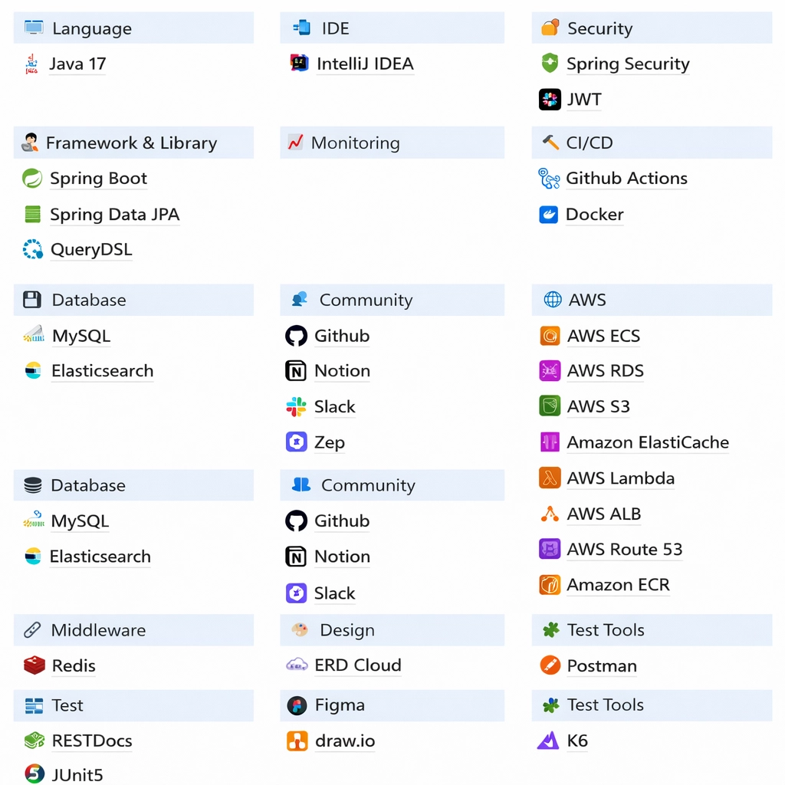
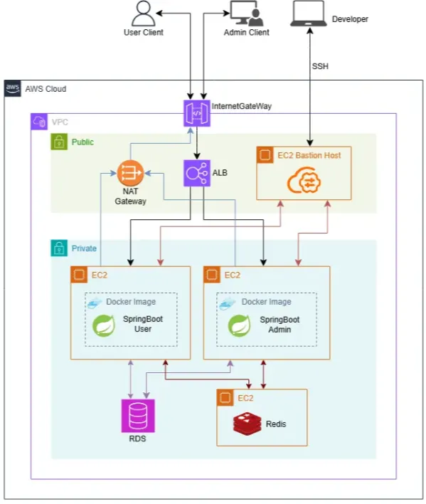
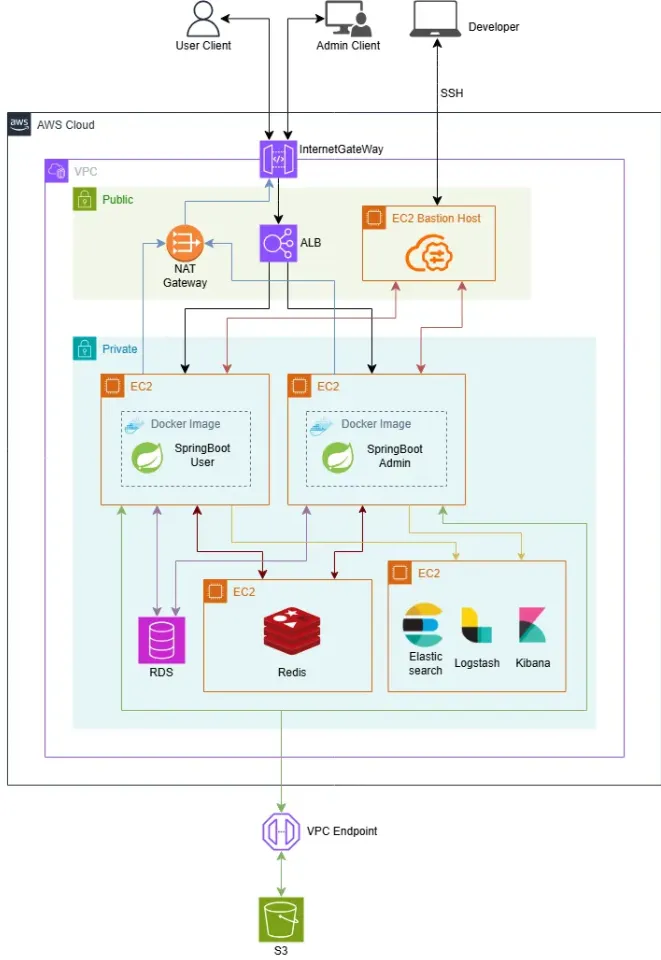
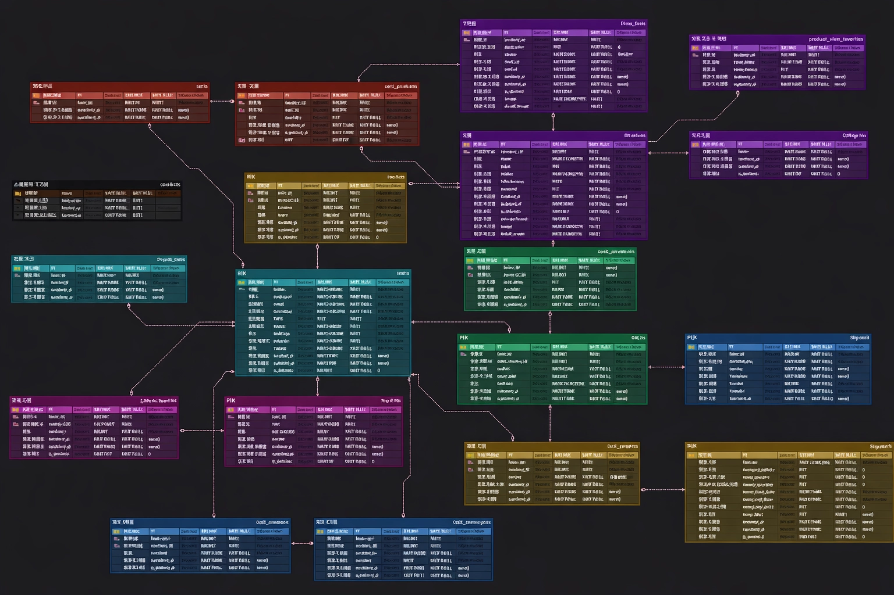

# “굿즈 커머스 플랫폼 - 싹쓰리”

## 목차
<!-- 하이퍼링크 걸어서 넣기 -->

---
## **📄** 프로젝트 소개

**“팬의 마음을 담은 굿즈를 가장 편하게 만나는 굿즈 커머스 플랫폼”**

> 좋아하는 팀을 응원하고, 취향을 표현하는 방법으로
>
>
> **굿즈 소비**는 이제 하나의 문화가 되었습니다.
>
> 하지만 굿즈 구매 과정은 여전히 불편합니다.
>
> 복잡한 주문 과정, 한정 수량으로 인한 혼란, 신뢰하기 어려운 판매 환경까지.
>

이런 문제에서 출발해

"**팬이 굿즈를 더 쉽고, 더 안전하게, 더 즐겁게 구매할 수 있는 공간**"을 만들고자

굿즈 판매 사이트 **싹쓰리 스토어**를 기획했습니다.

싹쓰리 스토어는 다양한 팀(그룹)을 테마로 한 공식 굿즈를 한 곳에서 만나고,

상품 조회부터 주문·결제까지의 과정을 직관적으로 제공하는 커머스 서비스입니다.

---
## 🔧 기술 스택 

<!--여기에 넣기-->

---
## ⚙️ 시스템 아키텍쳐

v1

v2

v3

---
## 💻 와이어프레임

<!-- 수정 후 최종본 넣기 -->

---
## 📑 ERD

---
## 📝 API 명세서
<!-- 여기에 넣기 -->

---
## 👊 주요 기능

🎖️ 인기 TOP 10 상품 조회

 

- **조회 수 기반 주간 인기 TOP 10 상품 조회 기능**
- **실시간 랭킹 정렬**

  Redis의 ZSet 자료구조를 활용하여 데이터 추가와 동시에 실시간 랭킹 정렬을 수행함으로써 대규모 트래픽 환경에서도 지연 시간 없이 인기 상품 데이터를 제공

- **랭킹 데이터의 일관성 유지**

  Redis라는 외부 인메모리 저장소를 이용하여 분산 서버 환경에서도 동일한 랭킹 데이터를 일관성 있게 공유하고 유지할 수 있음

- **최근 기록을 바탕으로 한 랭킹 구현**

  오랜 기간 누적된 데이터로 인한 신뢰도 하락을 극복하기 위해 Sliding Window를 통해, 특정 시점이 아닌 ‘최근 7일’이라는 연속적인 기간의 정확한 통계를 제공

🔎 상품 통합 검색

 

- **상품 통합 검색 기능**

  키워드, 최저 가격~최고 가격 범위 검색

  다양한 검색 조건을 결합한 동적 쿼리를 사용하여 사용자가 원하는 상품을 정확하고 빠르게 필터링 할 수 있는 검색 환경 제공

🔎 상품 통합 검색

 

- **정해진 시간에만 열리고 닫히는 한정 상품 판매 이벤트**
- **사용자에게 실시간 최신 오픈 정보 제공**
- **스케줄러, 캐시 사용으로 서비스 안정성 확보**

  스케줄러가 주기적으로 실행되어 타임딜 상태를 자동으로 전이

  트래픽이 집중도가 가장 높은 첫 페이지 중심 캐싱으로 메모리 부담 최소화

🔎 상품 통합 검색

 

- **정해진 시간에만 열리고 닫히는 한정 상품 판매 이벤트**
- **사용자에게 실시간 최신 오픈 정보 제공**
- **스케줄러, 캐시 사용으로 서비스 안정성 확보**

  스케줄러가 주기적으로 실행되어 타임딜 상태를 자동으로 전이

  트래픽이 집중도가 가장 높은 첫 페이지 중심 캐싱으로 메모리 부담 최소화

💵 주문 / 결제

 

- **주문/결제 기능**
- **주문 시 상품 재고 차감**

  상품 재고 차감 후 결제 단계로 넘어가 사용자의 안정적인 구매를 보장

  결제 실패 시 재고 차감을 롤백

- **결제 기능은 주문 생성 이후 결제 승인까지의 흐름을 담당함**

  사용자가 결제를 요청하면 서버는 주문 정보와 결제 금액을 검증한 후 PG사에 결제 승인 요청을 전달함

  결제 승인에 성공하면 주문 상태를 `DONE`으로 변경하고, 결제 실패 시에는 결제 실패 상태로 처리하여 결제 흐름을 종료함

  사용자가 주문을 취소하면 주문 취소와 동시에 PG사를 통해 결제 취소가 즉시 진행됨

🤳 실시간 문의 채팅

 

- **웹소켓을 이용한 실시간 채팅 기능**
- **관리자와 1:1 매칭 문의 채팅 지원**

  1:1 문의에서 해결하기 어렵고 실시간 상담이 필요한 경우 채팅으로 상담받을 수 있음

  사용자는 한 번에 한 개의 문의 채팅방을 가질 수 있음. 새 문의채팅을 진행하려면 기존의 문의 채팅을 종료해야함. 회원이 1:1 문의를 시작할 경우 채팅방이 자동으로 생성되고, 문의 채팅을 진행하다가 접속이 끊긴 경우 재접속 시 기존의 채팅방으로 연결

  사용자가 채팅 종료 버튼을 눌러 종료하거나, 회원이 채팅으로 종료 의사를 밝히고 종료 버튼을 누르지 않고 종료한 경우 혹은  회원이 1시간 이상 채팅에 답장이 없을 경우 관리자가 종료처리

