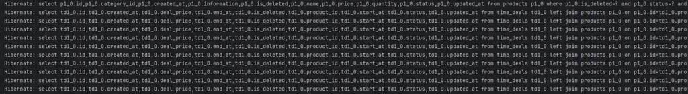
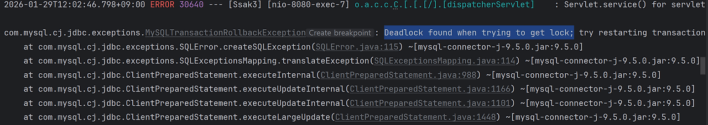

# “굿즈 커머스 플랫폼 - 싹쓰리”

## 목차
<!-- 하이퍼링크 걸어서 넣기 -->

---
## **📄** 프로젝트 소개

**“팬의 마음을 담은 굿즈를 가장 편하게 만나는 굿즈 커머스 플랫폼”**

> 좋아하는 팀을 응원하고, 취향을 표현하는 방법으로
>
>
> **굿즈 소비**는 이제 하나의 문화가 되었습니다.
>
> 하지만 굿즈 구매 과정은 여전히 불편합니다.
>
> 복잡한 주문 과정, 한정 수량으로 인한 혼란, 신뢰하기 어려운 판매 환경까지.
>

이런 문제에서 출발해

"**팬이 굿즈를 더 쉽고, 더 안전하게, 더 즐겁게 구매할 수 있는 공간**"을 만들고자

굿즈 판매 사이트 **싹쓰리 스토어**를 기획했습니다.

싹쓰리 스토어는 다양한 팀(그룹)을 테마로 한 공식 굿즈를 한 곳에서 만나고,

상품 조회부터 주문·결제까지의 과정을 직관적으로 제공하는 커머스 서비스입니다.


---
## 🔧 기술 스택 

<!--여기에 넣기-->


---
## ⚙️ 시스템 아키텍쳐
<details>
<summary><b>v1</b></summary>


</details>
<details>
<summary><b>v2</b></summary>


</details>
<details open>
<summary><b>v3</b></summary>


</details>

---
## 💻 와이어프레임

<!-- 수정 후 최종본 넣기 -->

---
## 📑 ERD


---
## 📝 API 명세서
<!-- 여기에 넣기 -->

---
## 👊 주요 기능

<details>
<summary><h4>🎖️ 인기 TOP 10 상품 조회</h4></summary>

- **조회 수 기반 주간 인기 TOP 10 상품 조회 기능**
- **실시간 랭킹 정렬**

  Redis의 ZSet 자료구조를 활용하여 데이터 추가와 동시에 실시간 랭킹 정렬을 수행함으로써 대규모 트래픽 환경에서도 지연 시간 없이 인기 상품 데이터를 제공

- **랭킹 데이터의 일관성 유지**

  Redis라는 외부 인메모리 저장소를 이용하여 분산 서버 환경에서도 동일한 랭킹 데이터를 일관성 있게 공유하고 유지할 수 있음

- **최근 기록을 바탕으로 한 랭킹 구현**

  오랜 기간 누적된 데이터로 인한 신뢰도 하락을 극복하기 위해 Sliding Window를 통해, 특정 시점이 아닌 ‘최근 7일’이라는 연속적인 기간의 정확한 통계를 제공

</details>

<details>
<summary><h4>🔎 상품 통합 검색</h4></summary>

- **상품 통합 검색 기능**

  키워드, 최저 가격~최고 가격 범위 검색

  다양한 검색 조건을 결합한 동적 쿼리를 사용하여 사용자가 원하는 상품을 정확하고 빠르게 필터링 할 수 있는 검색 환경 제공

</details>

<details>
<summary><h4>🕛 타임딜</h4></summary>

- **정해진 시간에만 열리고 닫히는 한정 상품 판매 이벤트**
- **사용자에게 실시간 최신 오픈 정보 제공**
- **스케줄러, 캐시 사용으로 서비스 안정성 확보**

  스케줄러가 주기적으로 실행되어 타임딜 상태를 자동으로 전이

  트래픽이 집중도가 가장 높은 첫 페이지 중심 캐싱으로 메모리 부담 최소화

</details>

<details>
<summary><h4>💵 주문 / 결제</h4></summary>

- **주문/결제 기능**
- **주문 시 상품 재고 차감**

  상품 재고 차감 후 결제 단계로 넘어가 사용자의 안정적인 구매를 보장

  결제 실패 시 재고 차감을 롤백

- **결제 기능은 주문 생성 이후 결제 승인까지의 흐름을 담당함**

  사용자가 결제를 요청하면 서버는 주문 정보와 결제 금액을 검증한 후 PG사에 결제 승인 요청을 전달함

  결제 승인에 성공하면 주문 상태를 `DONE`으로 변경하고, 결제 실패 시에는 결제 실패 상태로 처리하여 결제 흐름을 종료함

  사용자가 주문을 취소하면 주문 취소와 동시에 PG사를 통해 결제 취소가 즉시 진행됨

</details>

<details>
<summary><h4>🤳 실시간 문의 채팅</h4></summary>

- **웹소켓을 이용한 실시간 채팅 기능**
- **관리자와 1:1 매칭 문의 채팅 지원**

  1:1 문의에서 해결하기 어렵고 실시간 상담이 필요한 경우 채팅으로 상담받을 수 있음

  사용자는 한 번에 한 개의 문의 채팅방을 가질 수 있음. 새 문의채팅을 진행하려면 기존의 문의 채팅을 종료해야함. 회원이 1:1 문의를 시작할 경우 채팅방이 자동으로 생성되고, 문의 채팅을 진행하다가 접속이 끊긴 경우 재접속 시 기존의 채팅방으로 연결

  사용자가 채팅 종료 버튼을 눌러 종료하거나, 회원이 채팅으로 종료 의사를 밝히고 종료 버튼을 누르지 않고 종료한 경우 혹은  회원이 1시간 이상 채팅에 답장이 없을 경우 관리자가 종료처리
</details>

---
## 🛠 기술적 의사 결정
<details>
<summary><h3>✨ 인증 방식 결정 (Session vs JWT)</h3></summary>
  
<h3>⁉️ 의사 결정 발생 배경</h3>

- **서버 자원 효율성 및 확장성 확보**
- 사용자가 늘어남에 따라 서버 메모리에 세션 정보를 저장하는 방식은 메모리 부족의 위험성을 키우고, 향후 트래픽 대응을 위해 서버를 여러 대 띄우는 Scale-Out 상황에서 세션 불일치 문제를 경계했습니다.

<h3>🙋‍♀️ 의사 결정 과정</h3>

- **JWT 선택**
- 서버의 메모리 자원을 소모하지 않는 Stateless한 특성을 가진 JWT를 선택하여 서버 확장(Scale-out) 시 별도의 세션 클러스터링이나 공유 저장소 구축 없이도 대응 가능하도록 설계했습니다.

<h3>💡 고려한 대안</h3>

- **세션 기반 인증**
- 구현이 쉽고 보안 상 즉시 만료가 가능하다는 장점이 있으나, 서버 메모리의 부담과 향후 분산 환경에서의 인프라 복잡도 증가 우려로 제외했습니다.

<h3>✨ 해결 과정</h3>

1. `OncePerRequestFilter` 를 상속 받은 `JwtFilter` 를 구현하여 매 요청마다 토큰의 유효성을 검증하도록 설계했습니다.
2. `SecurityConfig` 에서 인증이 필요한 경로와 필요하지 않은 경로를 분리하고, Stateless 세션 정책을 명시하여 JWT의 취지에 맞게 설정했습니다.

<h3>📝 향후 고도화 방안</h3>

- **Refresh Token 도입**: 현재는 보안을 위해 Access Token의 만료 시간을 짧게 가져가고 있습니다. 사용자 편의성을 해치지 않으면서 보안을 유지하기 위해 Redis를 활용한 Refresh Token 저장소를 구축하여 토큰 탈취 리스크에 대응할 계획입니다.
- **토큰 블랙리스트 구현**: 로그아웃 시나리오에서 유효 기간이 남은 토큰을 강제로 무효화할 수 있도록 Redis에 로그아웃 된 토큰 정보를 저장하고 필터에서 이를 대조하는 로직을 추가하는 방향을 고려 중입니다.
</details>

<details>
<summary><h3>✨ OAuth 2.0 도입</h3></summary>
  
<h3>⁉️ 의사 결정 발생 배경</h3>

- **사용자 접근성 향상 및 운영 가시성 확보**
- 사용자가 느끼는 회원가입에 대한 심리적 장벽을 낮추고, 검증된 플랫폼의 보안 인프라를 활용하여 개인정보 관리 리스크를 줄이고자 했습니다.

<h3>🙋‍♀️ 의사 결정 과정</h3>

- **신뢰와 편의성의 균형**
  - **외부 API 의존성**: 카카오/구글 등 외부 플랫폼의 장애 시 인증 시스템이 마비될 수 있으나, 자체 회원가입 시스템과 병행으로 운영함으로써 리스크를 최소화
  - **사용자 편의성**: 복잡한 가입 절차를 생략하여 유입률 증가

<h3>💡 고려한 대안</h3>

- **카카오 vs 구글**
  - 국내 사용자 타겟팅이 우선이였기 때문에 접근성이 가장 높은 카카오를 1순위로 채택했습니다.

<h3>✨ 해결 과정</h3>

- **OAuth 2.0**
  - 카카오 인증 서버로부터 받은 Authorization Code를 Access Token으로 교환하고, 카카오로부터 사용자 정보를 받아 내부 서비스용 JWT를 발급하는 로직을 구현했습니다.

<h3>📝 향후 고도화 방안</h3>

- **OAuth Provider 확장**
  - 카카오 외에도 구글, 네이버 등 다양한 소셜 로그인을 인터페이스화하여 코드 수정 없이 확장 가능한 구조로 리팩토링 하고 싶습니다.
</details>

<details>
<summary><h3>📆 타임딜 스케줄러 도입 배경 및 결정</h3></summary>
  
<h3>⁉️ 의사 결정 발생 배경</h3>

- 타임딜은 **정해진 시간에 정확히 열리고 닫혀야 하는 기능**으로, 사용자에게 실시간으로 최신 정보를 제공해야 했습니다.
- 기존 방식인 **요청 시점 조회 방식**은 동시 접속자가 많을 경우 DB 부하가 급증하고 응답 지연 가능성이 있습니다.
- 따라서 **트래픽 집중 구간에서도 안정적으로 동작할 수 있는 방법**이 필요했습니다.

<h3>🙋‍♀️ 의사 결정 과정</h3>

- **요청 시점 조회 방식**
    - 사용자가 요청할 때마다 데이터를 조회
    - 트래픽이 몰리면 처리 속도 저하 가능
- **스케줄러 기반 준비 방식**
    - 타임딜 시작 전에 데이터를 미리 준비
    - 안정적이고 빠른 응답 가능

=> 비교 결과, 안정성과 속도 모두 확보 가능한 스케줄러 기반 방식을 선택했습니다.

<h3>💡 고려한 대안</h3>

- 요청 시점 조회 → 구현은 간단하지만 트래픽 집중 시 성능 저하 위험
- 스케줄러 기반 준비 → 사전 준비를 통해 트래픽 집중에도 안정적 운영 가능

<b>✨ 실행 및 결과</b>
- 타임딜 오픈 시간에 맞춰 데이터를 미리 준비
- 준비된 데이터를 시스템에 저장 → 사용자 요청 시 즉시 제공
- 덕분에 사용자 트래픽이 집중되어도 안정적인 서비스 제공 가능

<details>
  <summary>스케줄러 코드 예시</summary>
  
  
  - **설명:**
    - 스케줄러가 주기적으로 실행되어 **타임딜 상태를 자동으로 전이**
    - 조회 API는 단순히 상태 읽기만 수행 → 트래픽 집중에도 안정적

</details>

  - 스케줄러 도입으로 서비스 안정성과 사용자 경험 확보
</details>

<details>
<summary><h3>📈 WebSocket STOMP</h3></summary>
  
<h3>⁉️ 의사 결정 발생 배경</h3>

- ssak3 프로젝트는 사용자와 관리자 간의 1:1 문의 채팅 기능을 제공하고 있습니다. 
- 초기에는 순수 WebSocket으로 채팅 기능을 구현했으나 직접 모든 기능을 구현하려다 보니 구현난이도 상승 및 여러 가지의 문제 상황이 발생하게 되었습니다.
- 특히 Websocket만으로 구현했을 때에는 단순 채팅 기능만 구현하여 큰 문제가 없었지만 고도화를 진행하면서 개선의 필요성을 느꼈습니다.
<details>
    <summary>기존 코드</summary>
    
</details>

- **복잡한 메시지 라우팅**
- Handler 내에서 메시지 타입(ENTER, TALK, QUIT)별로 수동 분기 처리
- **세션 관리의 어려움**
    - 사용자 연결 정보를 직접 관리하고 추적해야 하는 복잡도
- **인증/인가 처리의 부재**
    - JWT 토큰 검증을 위한 별도 로직 구현 필요
- **연결 안정성**
    - 연결 끊김 감지 및 재연결 로직을 직접 구현해야 함

따라서 프로젝트가 확장되면서 더 체계적이고 유지보수 가능한 구조가 필요하다고 판단했습니다.

<h3>🙋‍♀️ 의사 결정 과정</h3>

- **관심사의 분리**
    - 네트워크 연결 관리와 채팅 비즈니스 로직이 한 곳에 섞여있는 기존 구조를 개선하여 로직 자체에만 집중할 수 있는 환경을 만들고자 했습니다.
- **유지보수 효율성**
    - 엔드포인트가 늘어날 때마다 `switch-case` 문이 무한정 길어지는 구조는 코드 작성 중 오류가 발생할 가능성이 높다고 판단되어 선언적 방식의 도입을 고려했습니다.
- **표준 규격의 도입**
    - 클라이언트와 서버가 서로 다른 방식으로 파싱 로직을 구현하는 대신 표준 프로토콜을 사용해 통신 규격을 통일하고자 했습니다.

<h3>💡 고려한 대안</h3>

#### 순수 WebSocket  vs STOMP

- **순수 WebSocket**
    
    **장점**
    
    - 완전한 프로토콜 설계 자유도
    - 최소한의 오버헤드로 빠른 응답 속도
    - 추가 라이브러리 불필요
    
    **단점**
    
    - 모든 메시지 파싱 및 라우팅 로직을 직접 구현
    - 세션 관리, 인증, 재연결 등 인프라 코드의 복잡도 증가
    - Redis 등 외부 시스템과 연동 시 모든 통신 프로토콜을 직접 구현
    - 코드 가독성 및 유지보수성 저하

- **STOMP**
    
    **장점**
    
    - **구조화된 메시지 형식**: COMMAND, headers, body로 명확한 메시지 구조
    - **자동 라우팅**: `@MessageMapping`을 통한 선언적 메시지 처리
    - **간편한 인증 처리**: `ChannelInterceptor`를 활용한 메시지 레벨 JWT 검증
    - **외부 브로커 연동 용이**: Spring 설정만으로 Redis 등과 즉시 연결 가능
    - **내장 HeartBeat**: 연결 상태 자동 모니터링 및 끊김 감지
    
    **단점**
    
    - 프레임 헤더로 인한 미세한 오버헤드 (채팅 서비스에서는 무시 가능)
    - STOMP 프로토콜 규격 준수 필요
    - 프론트엔드에서 stomp.js/sock.js 라이브러리 학습 필요

<h3>✨ 해결 과정</h3>

#### STOMP 사용 결정 이유

- **개발 생산성**
    - 정형화된 구조로 개발 시간 단축
- **확장성 대비**
    - 향후 분산 서버 환경에서 외부 브로커(Redis) 연동이 필수인데, STOMP는 설정 변경만으로 간편하게 연동 가능
- **보안 강화**
    - `ChannelInterceptor`를 통한 메시지 단위 JWT 검증으로 접근 차단
- **운영 안정성**
    - HeartBeat를 통한 자동 연결 관리로 장애 대응 용이
- **적합한 성능**
    - 채팅은 게임처럼 ms 단위 응답이 필요 없으므로 STOMP의 약간의 오버헤드는 허용 가능

#### 개선 과정
<details>
  <summary><b>기존의 길고 복잡했던 Handler 코드</b></summary>


```java
      
    @Component
    @RequiredArgsConstructor
    @Slf4j
    public class InquiryChatHandler extends TextWebSocketHandler {
    
        private final ObjectMapper objectMapper = new ObjectMapper();
        private final InquiryChatService inquiryChatService;
        private static Map<Long, Set<WebSocketSession>> roomSessions = new ConcurrentHashMap<>();  // 방 번호, 세선 정보
    
        @Override
        protected void handleTextMessage(WebSocketSession session, TextMessage message) throws Exception {
    
            String payload = message.getPayload(); // 전송된 메시지 문자열로 가져옴
    
            ChatMessageRequest request = objectMapper.readValue(payload, ChatMessageRequest.class);  // JSON 변환
    
            Long roomId = request.getRoomId();  // 채팅방 입장
    
            // 타입별 분리
            switch (request.getType()) {
                case ENTER:
                    // 방 세션 관리 및 입장
                    handleEnterRoom(roomId, session);
                    break;
    
                case SEND:
                    // DB 저장 및 브로드캐스팅
                    handleSendMessage(roomId, request);
                    break;
    
                case QUIT:
                    // 퇴장 알림 및 세션 정리
                    handleQuitRoom(roomId, request, session);
                    break;
            }
        }
    
        // ENTER: 세션 리스트에 추가
        private void handleEnterRoom(Long roomId, WebSocketSession session) {
    
            Set<WebSocketSession> sessions = roomSessions.get(roomId);
    
            // 방이 없는 경우 생성
            if (sessions == null) {
                sessions = Collections.newSetFromMap(new ConcurrentHashMap<>());
    
                roomSessions.put(roomId, sessions);
            }
    
            sessions.add(session);
    
             System.out.println("1:1 상담이 시작되었습니다.");
        }
    
        // SEND: DB 저장 후 방에 있는 모든 세션에게 메시지 전송
        private void handleSendMessage(Long roomId, ChatMessageRequest request) throws Exception {
    
            inquiryChatService.saveMessage(request); // DB 저장
    
            // 메시지 전달
            String output = request.getSenderRole() + ": " + request.getContent();
    
            broadcastToRoom(roomId, output);
        }
    
        // QUIT: 나간 세션 제거 및 채팅방 삭제
        private void handleQuitRoom(Long roomId, ChatMessageRequest request, WebSocketSession session) throws Exception {
    
            // 해당 세션 제거
            Set<WebSocketSession> sessions = roomSessions.get(roomId);
            if (sessions != null) {
                sessions.remove(session);
    
                // 관리자 / 회원의 상담 종료 알림
                broadcastToRoom(roomId, request.getSenderRole() + "님이 상담을 종료하셨습니다.");
    
                // 방 제거
                if (sessions.isEmpty()) {
                    roomSessions.remove(roomId);
                }
            }
    
            // 웹소켓 연결 끊기
            if (session.isOpen()) {
                session.close();
            }
    
            System.out.println(roomId + "번 방 상담 종료 및 세션 정리 완료");
        }
    
        // 방에 있는 모든 세션에게 메시지 발송하는 메서드
        private void broadcastToRoom(Long roomId, String message) throws Exception {
    
            Set<WebSocketSession> sessions = roomSessions.get(roomId);
    
            if (sessions != null) {
                TextMessage textMessage = new TextMessage(message);
                for (WebSocketSession s : sessions) {
                    if (s.isOpen()) {
                        s.sendMessage(textMessage);
                    }
                }
            }
        }
    
        // 세션의 연결이 끊겼을 때 리스트에서 삭제 + 방 없애기
        @Override
        public void afterConnectionClosed(WebSocketSession session, CloseStatus status) throws Exception {
    
            // 나간 세션들 지워주기
            for (Set<WebSocketSession> sessions : roomSessions.values()) {
                sessions.remove(session);
            }
    
            // 방이 빌 경우(모든 세션이 나간 경우) 방 자체를 삭제하기
            roomSessions.entrySet().removeIf(entry -> entry.getValue().isEmpty());
    
            System.out.println("연결 종료: " + session.getId());
        }
    }
```
    
</details>
    
<details>
  <summary><b>STOMP를 적용한 코드</b></summary>

- WebSocketConfig
    ```java

        @Override
        public void registerStompEndpoints(StompEndpointRegistry registry) {
            // 1. 처음 소켓 연결할 엔드포인트 설정
            registry.addEndpoint("/ssak3/stomp/chat")  // STOMP 전용 주소 사용
                    .setAllowedOrigins("*");  // 모든 도메인 허용(테스트용, 추후 수정 예정)
        }
    
        @Override
        public void configureMessageBroker(MessageBrokerRegistry registry) {
            // 2. 메시지를 보낼 때 Publish 설정
            // 클라이언트가 메시지를 보낼 때 /pub으로 시작하면 @MessageMapping이 가로챔
            registry.setApplicationDestinationPrefixes("/pub");
    
            // 3. 메시지를 받을 때 Subscribe 설정
            // 클라이언트가 /sub 주소를 구독하고 있으면 서버가 메시지를 해당 주소로 보내줌
            registry.enableSimpleBroker("/sub");  // 추후에 Redis로 확장
        }
    ```

- InquiryChatStompController

  
    ```java

        /**
         * 채팅 메시지 전송 API InquiryChatStompController
         */
        @MessageMapping("/chat/message")
        public void sendMessage(@Payload ChatMessageRequest request, StompHeaderAccessor accessor) {
            // StompHeaderAccessor: 웹소켓 메시지 안에 숨겨진 세션 정보, 인증 정보, 헤더 값들을 읽거나 수정
    
            // 핸들러의 세션에서 인증된 유저 정보 꺼내기
            Map<String, Object> sessionAttributes = accessor.getSessionAttributes();
            Long userId = (Long) sessionAttributes.get("userId");
            String role = (String) sessionAttributes.get("role");
    
            log.info("메시지 받음 - userId: {}, roomId: {}, content: {}", userId, request.getRoomId(), request.getContent());
    
            // Redis 먼저 발행
            ChatMessageResponse tempResponse = ChatMessageResponse.fromRequest(request, userId, role);
    
            log.info("Redis 발행 - roomId: {}, content: {}", tempResponse.getRoomId(), tempResponse.getContent());
    
            redisTemplate.convertAndSend(chatTopic.getTopic(), tempResponse);
    
            // DB 저장은 비동기로 처리
            inquiryChatService.saveMessageAsync(request, userId, role);
        }
    
        /**
         * 문의 채팅방 입장, 퇴장 알림 API
         */
        @MessageMapping("/chat/notice")
        public void sendNotice(@Payload ChatMessageRequest request) {
    
            // 채팅방 입장, 퇴장 시 알림으로 보내 줄 메시지
            String message = (request.getType() == ChatMessageType.ENTER)
                    ? request.getSenderRole() + "님이 입장했습니다."
                    : request.getSenderRole() + "님이 문의를 종료했습니다.";
    
            ChatMessageResponse response = ChatMessageResponse.from(request, message);
    
            redisTemplate.convertAndSend(chatTopic.getTopic(), response);  //
        }
    ```
</details>
   
    
- **STOMP 도입을 통한 채팅의 REST화:** 기존 `TextWebSocketHandler`에서 수동으로 `switch-case`문을 통해 메시지 타입을 구분하던 로직을 없앴습니다.


- 대신 @MessageMapping을 도입하여, 마치 REST API의 Controller처럼 경로(Path)를 기반으로 비즈니스 로직을 분리하여 코드 가독성과 유지보수성을 확보했습니다.
</details>

<details>
<summary><h3>📩 Redis pub/sub</h3></summary>
  
<h3>⁉️ 의사 결정 발생 배경</h3>

<details>
  <summary>1차 배포 아키텍쳐 설계도</summary>

  
</details>

*위 설계도는 ssak3 프로젝트의 1차 배포 아키텍처 설계도입니다.* 

해당 아키텍처를 보면 애플리케이션 서버 안에 Redis를 함께 구동하고 있음을 알 수 있습니다.

프로젝트 고도화 과정에서 User 서버와 Admin 서버로 분할하기로 결정했습니다.

- 분할 이유
    - 사용자 트래픽 폭증 시 관리자 서비스는 정상 운영되어야 함
    - 각 서버의 독립적인 스케일링 및 장애 격리

#### 발생한 문제

기존의 단일 서버 환경에서는 Spring의 **SimpleBroker**만으로 충분했습니다. 

하지만 서버가 분할될 경우 User 서버에 연결된 사용자 A와 Admin 서버에 연결된 관리자 B는 서로 다른 메모리 공간에 세션이 존재합니다. SimpleBroker는 자신의 서버 내부에만 메시지를 전달하므로 **서버 간 메시지 공유가 불가합니다.**

따라서 채팅방에서 한쪽이 보낸 메시지를 상대방이 받지 못하는 문제가 발생하게 되었고 이를 해결할 새로운 방안이 필요하게 되었습니다.

<h3>🙋‍♀️ 의사 결정 과정</h3>

- **메시지 브로커 도입**
    - 서버가 여러 대일 경우, A 서버에 접속한 사용자가 보낸 메시지를 B 서버에 접속한 사용자가 받지 못하는 '**데이터 파편화**' 문제를 해결하기 위해 서버 간 메시지를 공유할 매개체가 필요했습니다.

<h3>💡 고려한 대안</h3>

#### 전문 메시지 브로커 vs  Redis Pub/Sub

- **전문 메시지 브로커 (RabbitMQ, Kafka)**
    
    **장점**
    
    - 메시지 영속성 보장 (디스크 저장)
    - 복잡한 메시지 라우팅 및 큐 관리 기능
    - 대규모 메시지 처리 및 순서 보장
    
    **단점**
    
    - 별도 서버 구축 및 운영 비용
    - 과도한 기능으로 인한 복잡도 증가
    - 문의 채팅과 같은 간단한 Pub/Sub에 사용되기에는 오버스펙으로 볼 수 있음
    - 프로젝트 규모 대비 러닝 커브 높음
    
- **Redis Pub/Sub**
    
    **장점**
    
    - 이미 캐시 용도로 Redis 사용 중 (추가 인프라 불필요)
    - 극도로 빠른 메시지 전달 속도 (in-memory)
    - 간단한 Pub/Sub 구조로 학습 비용 최소화
    - Spring STOMP와 즉시 연동 가능 (설정만으로 완료)
    
    **단점**
    
    - **메시지 비영속성**: 전달 후 즉시 소멸 (브로커가 아닌 메시지 버스)
    - 구독자가 없으면 메시지 유실
    - 복잡한 라우팅이나 재처리 불가

<h3>✨ 해결 과정</h3>

#### Redis pub/sub으로 결정한 이유

- **실시간성 우선**
    - 채팅은 즉시성이 가장 중요하며, Redis의 in-memory 처리는 밀리초 단위 응답 보장
- **인프라 효율**
    - 기존 Redis 활용으로 추가 서버 불필요
- **프로젝트 적합성**
    - 1:1 채팅은 복잡한 메시지 큐 기능이 필요 없음
- **간단한 연동**
    - Spring 설정에서 `SimpleBroker` → `RedisMessageBroker`로 변경만으로 완료

#### 해결 과정

- **RedisMessageBroker 연동**
    - Spring의 `SimpleBroker`를 Redis 전용 브로커로 확장하여, 메시지 발행 시 Redis의 Topic을 거쳐 모든 서버로 전파되는 구조를 구축했습니다.
- **성능 최적화**
  
    - 메시지 수신 시 Redis 발행을 우선 처리하여 실시간성을 확보하고, 상대적으로 무거운 DB 저장은 비동기(saveMessageAsync)로 처리하여 사용자 응답 지연을 최소화했습니다.
 
<details> 
<summary>Redis 적용한 코드</summary>

  - RedisConfig
    ```java
        // Redis로부터 오는 메시지를 구독하는 컨테이너
    @Bean
    public RedisMessageListenerContainer redisMessageListenerContainer(
            RedisConnectionFactory connectionFactory,
            MessageListenerAdapter listenerAdapter) {
        RedisMessageListenerContainer container = new RedisMessageListenerContainer();
        container.setConnectionFactory(connectionFactory);
        container.addMessageListener(listenerAdapter, new ChannelTopic("chat"));   // "chat"을 구독하도록 설정
        return container;
    }

    // 실제 메시지를 처리할 구독 설정
    @Bean
    public MessageListenerAdapter listenerAdapter(RedisSubscriber subscriber) {
        return new MessageListenerAdapter(subscriber, "onMessage");  // Redis에서 응답이 오면 onMessage 실행
    }
    ```

- InquiryChatStompController
```java
      
    /**
     * 채팅 메시지 전송 API 
     */
    @MessageMapping("/chat/message")
    public void sendMessage(@Payload ChatMessageRequest request, StompHeaderAccessor accessor) {
        // StompHeaderAccessor: 웹소켓 메시지 안에 숨겨진 세션 정보, 인증 정보, 헤더 값들을 읽거나 수정

        // 핸들러의 세션에서 인증된 유저 정보 꺼내기
        Map<String, Object> sessionAttributes = accessor.getSessionAttributes();
        Long userId = (Long) sessionAttributes.get("userId");
        String role = (String) sessionAttributes.get("role");

        // Redis 먼저 발행
        ChatMessageResponse tempResponse = ChatMessageResponse.fromRequest(request, userId, role);

        redisTemplate.convertAndSend(chatTopic.getTopic(), tempResponse);

        // DB 저장은 비동기로 처리
        inquiryChatService.saveMessageAsync(request, userId, role);
    }
    
```

</details>

<h3>📝 향후 고도화 방안</h3>

- **분산 세션 관리 통합**: 현재 각 서버가 개별적으로 관리하는 웹소켓 세션 정보를 Redis로 통합 관리하여, 어떤 서버에 접속하더라도 사용자의 실시간 접속 상태를 정확히 파악할 수 있는 Presence 관리 서버 기능을 추가하고 싶습니다..

</details>

<details>
<summary><h3>👷 BastionHost</h3></summary>
  
<h3>⁉️ 의사 결정 발생 배경</h3>

<details>
  <summary>1차 배포 아키텍쳐 설계도</summary>

  
</details>

*위 설계도는 ssak3 프로젝트의 1차 배포 아키텍처 설계도입니다.* 

- 해당 아키텍처를 보면 데이터베이스와 애플리케이션 서버가 **public subnet에 위치하고 있어 보안 위협에 그대로 노출**되고 있다는 문제가 있었습니다. 

- 서비스의 안전성을 위해 **내부 자원들을 격리하면서도 개발자가 안전하게 서버를 관리할 수 있는 전용 통로가 필요**했습니다.

<h3>🙋‍♀️ 의사 결정 과정</h3>

- **공격 표면의 최소화**
    - 모든 인스턴스에 공인 IP를 할당하면 관리 포인트가 늘어나고 공격 노출 범위가 넓어지므로, 외부 노출 창구를 하나로 제한한다는 원칙을 세웠습니다.
- **네트워크 계층화**
    - 서비스 로직이 돌아가는 애플리케이션 서버와 중요한 데이터가 담긴 DB 서버는 Private Subnet에 위치시키는 것으로 설계 방향성을 정했습니다.
- **접근 통제**
    - 서버를 직접적으로 제어하는 관리자만 특정 경로로 접근하도록 설계하고자 하였습니다.

<h3>💡 고려한 대안</h3>

#### 외부 포트 개방 vs Bastion Host

- **외부 포트 개방(v1)**
    - 보안 그룹 설정만으로 소프트웨어적 접근 제어는 가능하지만 보안 위협에 노출됨.
- **Bastion Host(v2 이후)**
    - 모든 priavate 서버 접근을 Bastion을 통과해야만 접속 가능하도록 통제하여 보안성을 높일 수 있음.

#### 보안그룹 설정만으로 부족한 이유?

Public Subnet에 있는 서버는 Public IP를 가지는데 이는 인터넷 어디서든 그 서버의 주소로 패킷을 보낼 수 있다는 것을 의미합니다. 보안그룹 설정을 잘못 할 경우 즉시 해킹 위험에 노출됩니다.

반면에 Private Subnet에 있는 서버는 Public IP 자체가 없으므로 이러한 위험에서 벗어날 수 있습니다. 설정에 문제가 생기더라도 물리적으로 2중 보안이 가능합니다.

<h3>✨ 해결 과정</h3>
<details>
  <summary>2차 배포 아키텍처 설계도</summary>
  
  

</details>

*위 설계도는 ssak3 프로젝트의 2차 배포 아키텍처 설계도입니다.*  

- v1에서 public subnet만 있었던 것과 달리 public subnet과 private subnet으로 분리되었습니다.

- 서버 관리자의 경우 Ec2나 RDS에 직접적으로 접속해야하므로 Bastion Host를 이용해 접근 제어를 하도록 하였습니다.

#### 개선 내용

- **Bastion Host 구축**
    - AWS EC2를 활용해 퍼블릭 서브넷에 Bastion Host를 배치했습니다.
- **SSH 터널링 적용**
    - 실제 서비스 서버는 프라이빗 서브넷에 위치시키고, 오직 Bastion Host의 특정 IP로부터 오는 SSH 요청만 수용하도록 보안 그룹을 강화했습니다.

<h3>📝 향후 고도화 방안</h3>

- **Audit Log 관리**
    - 현재는 Bastion Host를 통해 접속이 가능하지만, 향후 관리자가 늘어날 것에 대비하여 접속 후 실행한 명령어를 기록하는 로깅 시스템을 구축해보고 싶습니다.
- **AWS Systems Manager(SSM) 도입**
    - 현재는 SSH 키를 사용한 방식을 사용하고 있지만 이 방식도 키가 유출 및 분실 될 경우의 위험성을 인지하고 있습니다. 이러한 위험을 없애기 위해, 포트 개방 없이 브라우저 기반으로 안전하게 인스턴스에 접속할 수 있는 SSM Session Manager로 전환하는 고도화 방안을 고려하고 있습니다.

</details>


---
## 🚩 트러블 슈팅
<details>
<summary><h3>✨ 인기 조회수 TOP 10 조회 시 발생한 N+1 문제</h3></summary>

<h3>⚠️ 문제 상황</h3>


- 인기 조회수 TOP 10 상품을 조회할 때, 상품 정보를 조회하는 쿼리는 한 번만 날아갔는데 타임딜 정보를 조회하는 쿼리가 10개가 추가로 날아가는 문제 발생

<h3>🙋‍♀️ 문제 발생 원인</h3>


- `for` 문에서 상품 id 개수만큼 반복문을 돌면서 `TimeDealRepository`의 `findByProductId(productId)`를 호출

- Redis에서 인기 조회수 상품 ID를 10개를 획득한 후, 반복문을 돌며 각 상품에 대한 타임딜 정보를 DB에서 조회

- 결과적으로 로직 상의 문제로 ID 목록 1번 + 타임딜 정보 N번의 문제가 발생

<h3>✨ 해결 과정</h3>

- **해결 방법**
  

  1. Redis가 정렬해준 데이터를 이용해 조회수 TOP 10 상품 id 목록을 가져옵니다.
  2. N+1 문제를 방지하기 위해, 10개의 상품 id를 한 번에 넘겨 상품 정보와 타임딜 정보를 통째로 가져옵니다.
  3. 가져온 데이터들을 상품 id를 Key로 하는 Map 구조로 변환하여, `for` 문 안에서 반복적인 `TimeDealRepository` 접근 없이 타임딜 정보를 즉시 가져왔습니다.

- **해결 후**


</details>

<details>
<summary><h3>✨ 로깅 시 USER ID가 null로 찍히는 문제</h3></summary>

<h3>⚠️ 문제 상황</h3>


- LoggingFilter에서 인증된 사용자의 요청임에도 불구하고 USER_ID가 계속 null로 찍히는 문제가 발생했습니다.

<h3>🙋‍♀️ 문제 발생 원인</h3>
<details>
<summary>LoggingFilter.java</summary>

```java

package com.example.ssak3.common.filter;

import com.example.ssak3.common.model.AuthUser;
import jakarta.servlet.FilterChain;
import jakarta.servlet.ServletException;
import jakarta.servlet.http.HttpServletRequest;
import jakarta.servlet.http.HttpServletResponse;
import lombok.extern.slf4j.Slf4j;
import org.slf4j.MDC;
import org.springframework.core.Ordered;
import org.springframework.core.annotation.Order;
import org.springframework.security.core.Authentication;
import org.springframework.security.core.context.SecurityContextHolder;
import org.springframework.stereotype.Component;
import org.springframework.web.filter.OncePerRequestFilter;

import java.io.IOException;
import java.util.UUID;

/**
* HTTP 요청에 대한 로그 담당
  */
  @Slf4j
  @Component
  @Order(Ordered.HIGHEST_PRECEDENCE)
  public class LoggingFilter extends OncePerRequestFilter {

  @Override
  protected void doFilterInternal(HttpServletRequest request, HttpServletResponse response, FilterChain filterChain) throws ServletException, IOException {

       // 실행 시작 시간
       long startTime = System.currentTimeMillis();

       // API 요청 정보
       String url = request.getRequestURI();
       String method = request.getMethod();
       String queryParams = request.getQueryString();

       // 인증 정보 꺼내기
       Authentication auth = SecurityContextHolder.getContext().getAuthentication();
       Long userId = null;

       if (auth != null && auth.isAuthenticated()) {
           AuthUser user = (AuthUser) auth.getPrincipal();
           userId = user.getId();
       }

       // TraceId 생성
       String traceId = UUID.randomUUID().toString().substring(0, 8);
       
       // MDC에 저장: 이 스레드에서 찍히는 모든 로그에 traceId가 붙음
       MDC.put("traceId", traceId);

       try {
           filterChain.doFilter(request, response);
       } finally {
           int statusCode = response.getStatus();

           long endTime = System.currentTimeMillis();

           if (statusCode >= 500) {
               log.error("USER_ID: {} | STATUS_CODE: {} | URL: {} | METHOD: {} | QUERY_PARAMS: {} | EXECUTION_TIME: {} ms",
                       userId, statusCode, url, method, queryParams, endTime - startTime);
           } else if (statusCode >= 400) {
               log.warn("USER_ID: {} | STATUS_CODE: {} | URL: {} | METHOD: {} | QUERY_PARAMS: {} | EXECUTION_TIME: {} ms",
                       userId, statusCode, url, method, queryParams, endTime - startTime);
           }

           // 스레드 풀을 재사용하기 때문에 작업이 끝나면 MDC를 반드시 비워야 함
           MDC.clear();
       }
  }
  }

```

</details>


원인은 Filter Chain의 우선 순위 문제였습니다.

`@Order(Ordered.HIGHEST_PRECEDENCE)` 어노테이션으로 인해 해당 로깅 필터가 최앞단에 위치하게 되었고, 사용자의 인증 정보를 확인하여 `SecurityContextHolder`에 넣어주는 `JwtFilter`보다 `LoggingFilter` 가 먼저 실행되었습니다.

그 결과, 인증 객체가 생성되기 전에 로그를 찍으려고 시도하다 보니 `SecurityContext` 에서 USER 정보를 가져오지 못해 `USER_ID`가 항상 null이 되었습니다.

<h3>✨ 해결 과정</h3>


- LoggingFilter를 JwtFilter와 UsernamePasswordAuthenticationFilter 사이에 두어 인증 정보가 담긴 후에 처리 되게 하면서 인증 정보가 지워지기 전에 로그를 찍을 수 있도록 설정해서 해결

</details>

<details>
<summary><h3>🐛 분산 서버 환경에서 스케줄러 중복 실행 문제</h3></summary>

<h3>⚠️ 문제 상황</h3>


- 분산 서버 환경에서 스케줄러 동작 중 이슈가 발생했습니다.
- 동일한 스케줄러가 **서버별로 동시에 실행**되는 현상을 확인했습니다.
- 한 번만 실행되어야 하는 배치 작업이 **중복 수행**되고 있었습니다.

<h3>🙋‍♀️ 문제 발생 원인</h3>
- 서버를 수평 확장하면서 애플리케이션이 **각 서버에 독립적으로 실행**되고 있었습니다.
- 이로 인해 스케줄러 또한 서버마다 각각 등록되어 동작했습니다.
- 스케줄러 실행 시 **다른 서버의 실행 여부를 제어하거나 확인하는 로직이 부재**한 상태였습니다.
- 분산 환경에 대한 고려 없이 단일 서버 기준으로 스케줄러를 설계한 것이 원인이었습니다.

아래 로그를 통해 동일한 시각에 여러 서버에서 스케줄러가 동시에 실행되고 있음을 확인할 수 있었습니다.


동일한 실행 시각에 각 서버 인스턴스에서 TimeDeal Scheduler START 로그가 출력되며, 스케줄러가 서버 수만큼 중복 실행되고 있음을 확인할 수 있습니다.

<h3>💡 고려한 대안</h3>

문제 해결을 위해 다음과 같은 방안을 검토했습니다.

1. **특정 서버에서만 스케줄러 실행**
    - 설정을 통해 한 서버에만 스케줄러를 활성화
    - 서버 장애 시 스케줄러가 동작하지 않을 위험이 있습니다.

2. **DB Lock 활용**
    - 스케줄러 실행 시 DB Row Lock 또는 플래그를 사용
    - 트랜잭션 관리 부담 증가 및 DB 부하 우려가 있습니다.

3. **분산 락(Distributed Lock) 적용 — ShedLock 라이브러리 활용**
    - `@SchedulerLock` 어노테이션을 사용해 분산 락을 손쉽게 구현
    - 스케줄러 실행 시 공용 저장소에 락을 획득하도록 처리
    - `lockAtMostFor`, `lockAtLeastFor` 옵션으로 락 지속 시간 제어 가능
    - 서버 장애 시에도 락 해제 가능하며, 분산 환경에 적합하고 확장성 있는 방식입니다.

여러 대안 중 **ShedLock 기반 분산 락 방식을 선택했습니다.**

<h3>✨ 해결 과정</h3>
스케줄러 메서드에 @SchedulerLock 어노테이션을 적용하여 분산 락을 획득하는 구조로 구현했습니다.


- `name` 속성으로 락 이름을 지정하여 여러 스케줄러 간 락 충돌을 방지했습니다.
- `lockAtMostFor`는 락을 최대 유지하는 시간으로, 락이 장시간 해제되지 않는 상황을 방지합니다.
- `lockAtLeastFor`는 락을 최소 유지하는 시간으로, 너무 잦은 락 획득과 해제를 방지합니다.
- 락 획득에 성공한 인스턴스에서만 스케줄러 로직을 실행하며, 락 획득에 실패한 다른 인스턴스는 실행하지 않습니다.

이로써 **분산 서버 환경에서도 스케줄러가 한 번만 실행됨을 보장**할 수 있었습니다.

아래 로그는 여러 인스턴스가 동시에 기동된 환경에서, **락을 획득한 1개의 인스턴스만 스케줄러를 실행한 예시**입니다


<h3>📝 향후 고도화 방안</h3>
- 락 획득 실패시 재시도 로직 추가
- 트랜잭션 실패 또는 서버 장애 시 **스케줄러 작업 복구 전략 마련**

</details>

<details>
<summary><h3>✨ 동시 요청 환경에서 데드락 및 정합성 문제 해결</h3></summary>

<h3>⚠️ 문제 상황</h3>
JMeter를 사용하여 상품 구매 기능에 대한 동시성 테스트 진행 중 데드락 발생


<h3>🙋‍♀️ 문제 발생 원인</h3>
- 원인 분석
    - 작성한 코드와 실제 실행되는 쿼리의 순서가 다르다는 것을 발견
        - 작성한 코드 : select → update → insert
        - 실제 실행 순서 : select → insert → update
        

    - 영속성 컨텍스트의 쓰기 지연 때문에 순서의 변화가 생긴다
        - JPA에서는 쓰기 작업을 DB에 효율적으로 반영하기 위해 트랜잭션에서 발생한 모든 쓰기 작업을 기록해두고 한꺼번에 실행

      ⇒ 이 과정에서 삽입 쿼리가 업데이트 쿼리보다 먼저 실행

- 핵심 원인
    - MySQL의 기본 격리 수준인 Repeatable Read에서는 단순 조회는 s-lock을 사용하지 않고 MVCC를 사용 → 초기 단계에서 여러 트랜잭션이 동시 진입
    - OrderProduct 삽입 시 정합성 보장을 위해 DB는 외래키 관계에 있는 부모테이블(Product)에 s-lock을 건다
    - 이후 상품의 재고를 차감하기 위한 update 쿼리가 실행되면서 s-lock에서 x-lock으로 승격 시도
        - Transaction(1)에서 s-lock을 잡고 x-lock으로 승격 시도 -> Transaction(2)의 s-lock이 풀리기를 대기
        - Transaction(2)에서도 s-lock을 잡고 x-lock으로 승격 시도 -> Transaction(1)의 s-lock이 풀리기를 대기
      

      

      ===> Deadlock 발생

<h3>💡 고려한 대안</h3>

#### update 이후 insert가 실행되도록 락 획득 순서 보장

- update 이후 insert가 실행되도록 락 획득 순서update 후 바로 flush()를 실행시켜 x-lock을 선점
  

- 결과
    - 기존(insert 후 update) → 현재(update 후 insert)
  


- 데드락은 해결되었으나 동시성 문제 발생
    - 재고가 100인 상품에 대해 100건의 구매 동시성 테스트 시 주문 수와 재고 차감 수가 맞지 않는 문제 발생
        - 주문 생성 수 : 100
        - 재고 차감 수 : 39  (100→61)
      
    

    


<h3>✨ 해결 과정</h3>
#### 비관락 적용

- product 조회 시 비관락 적용
- 장점 : 데이터 조회 시점부터 x-lock을 획득하여 다른 트랜잭션의 접근을 차단 ⇒ 데이터 정합성 보장
- 단점 : 순차적 처리를 하게 되어 병목 현상 발생 가능


비관적 락은 성능은 떨어지지만, 주문 도메인에서는 정합성이 최우선이므로 성능 손실을 감수하더라도 무결성을 보장하는 비관락을 선정

<h3>📝 향후 고도화 방안</h3>
- 비관락 사용 시 동시 처리 성능이 저하되는 문제가 발생할 수 있으므로 향후 트래픽 증가 시 성능에 미치는 영향을 지속적으로 관찰하고 필요하다면 분산락 등 다른 동시성 제어 방식도 고려해 볼 필요가 있다.

</details>
